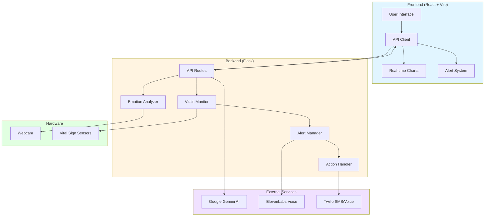
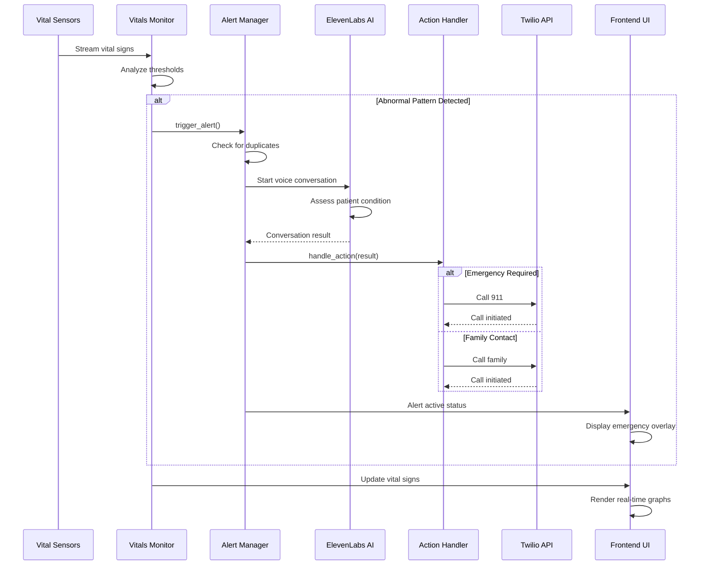
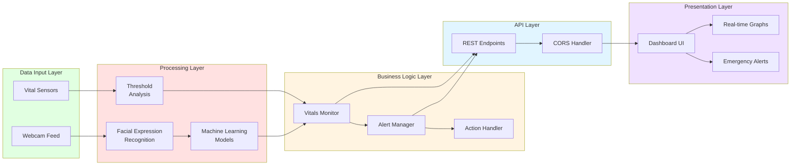
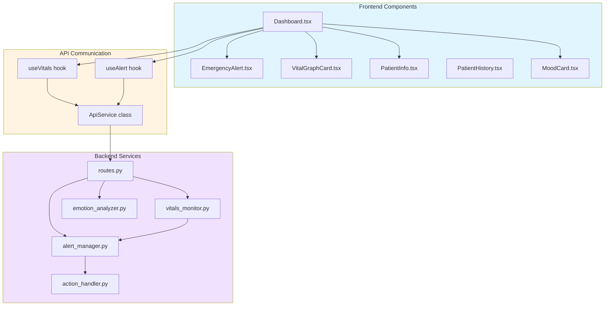

# PatientPulse

Real-time patient monitoring system with AI-powered vital sign analysis and automated emergency response.

[](LICENSE)
[](https://reactjs.org/)
[](https://www.python.org/)
[](https://flask.palletsprojects.com/)
[](https://www.typescriptlang.org/)

## Overview

PatientPulse is a healthcare monitoring platform that provides continuous vital sign tracking, facial expression analysis, and intelligent emergency response coordination. The system combines computer vision, machine learning, and telecommunications to enable real-time patient assessment and automated intervention protocols.

## System Architecture



## Key Features

- Continuous vital sign monitoring (heart rate, respiratory rate)
- Facial expression recognition for mood and distress detection
- Automated anomaly detection with configurable thresholds
- Emergency alert system with audio and visual notifications
- AI-powered voice conversation for patient assessment
- Comprehensive medical record management
- Real-time data visualization with historical trending

## Alert Processing Workflow



## Data Flow Architecture



## Technology Stack

### Frontend

| Component | Version | Purpose |
|-----------|---------|---------|
| React | 18.3 | UI framework |
| Vite | 5.4 | Build tooling and development server |
| TypeScript | 5.8 | Static type checking |
| Tailwind CSS | 3.4 | Utility-first CSS framework |
| Radix UI | Latest | Accessible component primitives |
| Recharts | 2.15 | Chart library for data visualization |
| TanStack Query | 5.83 | Asynchronous state management |
| React Router | 6.30 | Client-side routing |

### Backend

| Component | Version | Purpose |
|-----------|---------|---------|
| Flask | Latest | Python web framework |
| Google Gemini AI | Latest | Natural language processing |
| TensorFlow | Latest | Machine learning framework |
| FER | Latest | Facial emotion recognition library |
| OpenCV | Latest | Computer vision operations |
| Twilio | 9.0.4 | SMS and voice communication |
| Flask-CORS | Latest | Cross-origin resource sharing |

## Component Interaction Map



## Prerequisites

- Node.js 18.0 or higher
- Python 3.10 or higher
- Webcam device for facial analysis
- Google Gemini API credentials
- Twilio account for emergency communications

## Installation

### Backend Configuration

```bash
cd backend/gemini

# Create and activate virtual environment
python -m venv venv
source venv/bin/activate  # On Windows: venv\Scripts\activate

# Install dependencies
pip install -r requirements.txt

# Configure environment variables
cp .env.example .env
# Edit .env with your API credentials
```

Required environment variables:
```env
GEMINI_API_KEY=your_gemini_api_key
TWILIO_ACCOUNT_SID=your_twilio_sid
TWILIO_AUTH_TOKEN=your_twilio_token
TWILIO_PHONE_NUMBER=your_twilio_number
```

### Frontend Configuration

```bash
cd frontend

# Install dependencies
npm install

# Development server will proxy to http://localhost:5000
```

## Running the Application

Start the backend server:
```bash
cd backend/gemini
source venv/bin/activate  # On Windows: venv\Scripts\activate
python main.py
```

In a separate terminal, start the frontend:
```bash
cd frontend
npm run dev
```

The application will be available at `http://localhost:5173`, with the API running at `http://localhost:5000`.

## API Documentation

### Vital Signs Endpoints

**GET** `/api/vitals/current`  
Returns current vital signs and emotion analysis data.

Response:
```json
{
  "pulse_rate": 72,
  "breathing_rate": 16,
  "timestamp": "2024-11-23T12:00:00Z",
  "emotion": {
    "dominant": "neutral",
    "confidence": 0.85
  },
  "emotion_summary": "Patient appears calm"
}
```

**GET** `/api/vitals/history?limit=<n>`  
Returns historical vital sign records.

### Alert Management Endpoints

**GET** `/api/alerts/active`  
Returns current alert status.

Response:
```json
{
  "active": true,
  "alert_id": "alert_123456",
  "triggered_at": "2024-11-23T12:00:00Z"
}
```

**GET** `/api/alerts/history`  
Returns historical alert records.

### System Health Endpoint

**GET** `/api/health`  
Returns API health status and version information.
